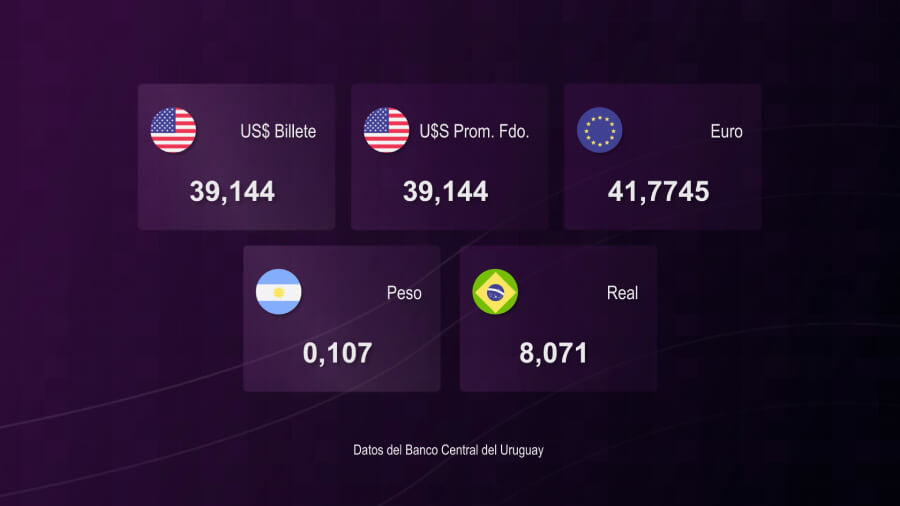

# Render currencies

Scrap the web of Banco Central del Uruguay, set the currency info in an After Effects comp and render.



## Used libraries:

Axios: Promise-based HTTP client for the browser and node.js

Cheerio: Parses markup and provides an API for traversing/manipulating the resulting data structure

## Instructions

1. Clone the repo
   ```sh
   git clone https://github.com/lopezrunco/ae-script-render-web-currencies.git
   ```
2. Install NPM packages
   ```sh
   npm i
   ```
3. Run scraper
   ```sh
   node fetch-currencies.js
   # All data will be stored in data.json file
   ```

4. Go to the After Effects project and run the script render.js

## Tested in:

```sh
# After Effects 2022
```